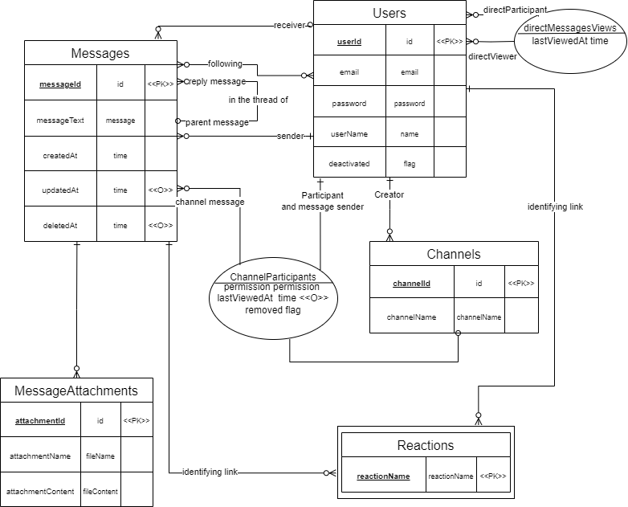
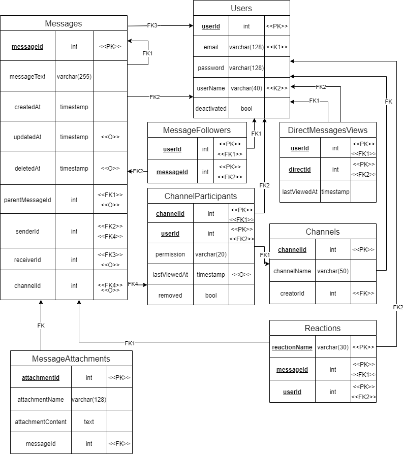

Описание проекта
================

Проект содержит описание базы данных, которая могла бы быть использована
для создания мессенджера наподобие mattermost. В базе данных планируется
поддержать хранение текстовых сообщений, вложений сообщений, каналов,
реакций, подписчиков сообщений, а также сделать возможным получение
непрочитанных сообщений из чатов.

Используемая СУБД
=================
PostgreSql 15.4

Построение отношений
====================

В результате предварительного проектирования были выделены следующие
отношения:

-   Users --- пользователи, зарегистрированные в мессенджере

-   Messages --- текстовые сообщения

-   MessageAttachments -- вложения (файлы), соответствующие сообщению

-   Channels -- каналы (чаты) с сообщениями

-   ChannelParticipants -- пользователи, находящиеся в канале

-   DirectMessagesViews -- личные сообщения (директы) и соответствующие
    им моменты последнего просмотра канала.

-   MessageFollowers -- пользователи, подписавшиеся на сообщения
    >тред\*\*, соответствующий сообщению, отображается у подписавшегося
    пользователя в его тредах\*\*

-   Reactions -- реакции на сообщениях

> тред - набор сообщений (ответов), относящихся к одному и тому же
сообщению (родительскому). Само родительское сообщение в тред не входит.

Отношение Users
---------------

Атрибуты:

-   UserId --- идентификатор пользователя, зарегистрированного в
    мессенджере

-   Email -- почта пользователя 
    > используется как логин для входа в систему

-   Password -- пароль для входа в мессенджере

-   UserName -- имя пользователя

-   Deactivated -- признак активности пользователя 
    > при удалении аккаунта Deactivated = true

Функциональные зависимости:

-   UserId → UserName, Password, Email, Deactivated

-   Email → UserId

-   UserName → UserId

Ключи:

-   UserId

-   Email

-   UserName

Отношение находится в 1НФ, так как нет повторяющихся групп, все значения
атомарны и имеется ключ UserId. Отношение находится в 2НФ, так как все
неключевые атрибуты (Deactivated, Password) зависят от ключа в целом
(ключи простые). Отношение находится в 3НФ, так как все неключевые
атрибуты непосредственно зависят от ключей (в левых частях нетривиальных
ФЗ только ключи). Все ключи отношения простые, и оно находится в 3NF,
поэтому по теореме Дейта Фейгина 1 оно находится в 5NF.

Отношение Messages
------------------

Атрибуты:

-   MessageId -- идентификтор сообщения

-   MessageText -- текст сообщения

-   SenderId \-- идентификатор пользователя, написавшего сообщение

-   ParentMessageId -- идентификатор сообщения, начинающего тред, в
    котором находится данное сообщение 
    > null, если сообщение не находится ни в каком треде

-   ChannelId -- идентификатор канала, в котором написано сообщение
    > null, если сообщение написано в личных сообщениях

-   ReceiverId -- идентификатор пользователя, которому написано сообщение 
    > null, если сообщение написано в канале 

-   CreatedAt -- время создания сообщения

-   UpdatedAt -- время последнего редактирования сообщения 
    > null, если не редактировалось после создания

-   DeletedAt -- время удаления сообщения 
    > null, если не удалялось

Функциональные зависимости:

-   MessageId → MessageText, SenderId, CreatedAt, UpdatedAt, DeletedAt,
    ChannelId. ReceiverId, ParentMessageId

Ключи:

-   MessageId

Отношение Channels
------------------

Атрибуты:

-   ChannelId -- идентификатор канала

-   ChannelName -- название канала

-   CreatorId -- идентификатор пользователя, создавшего канал

Функциональные зависимости:

-   ChannelId → ChannelName, CreatorId

> (Функциональной зависимости ChannelName, CreatorId → ChannelId нет,
> так как один и тот же пользователь может создать два разных канала с
> одинаковыми названиями)

Ключи:

-   ChannelId

Отношение ChannelParticipants
-----------------------------

Атрибуты:

-   Permission -- права пользователя в канале 
    > WRITER, EDITOR, OWNER

-   ChannelId -- идентификатор канала

-   UserId -- идентификатор пользователя, находящегося в канале

-   LastViewedAt -- время последнего просмотра канала пользователем
    > null, если пользователь не смотрел канал

-   Removed -- флаг, показывающий, удалён ли пользователь из канала 
    > при удалении пользователя из канала Removed = true)

Функциональные зависимости:

-   ChannelId, UserId → Permission, LastViewedAt, Removed

Ключи:

-   ChannelId, UserId

Отношение MessageAttachments
----------------------------

Атрибуты:

-   AttachmentId -- идентификатор вложения (файла)

-   MessageId -- идентификатор сообщения, соответствующего вложению

-   AttachmentName -- название вложения

-   AttachmentContent -- содержимое вложения

Функциональные зависимости:

-   AttachmentId → MessageId, AttachmentName, AttachmentContent

Ключи:

-   AttachmentId

Отношение Reactions
-------------------

Атрибуты:

-   ReactionName -- текстовое наименование реакции

-   MessageId -- идентификатор сообщения, на котором поставлена реакция

-   UserId -- идентификатор пользователя

Функциональные зависимости:

Нет нетривиальных ФЗ

Ключи:

-   MessageId, UserId, ReactionName 
   > (MessageId, UserId не подойдёт, так как на одном и том же сообщении может ставить несколько различных реакций)

Отношение находится в 1НФ, так как нет повторяющихся групп, все значения
атомарны и имеется ключ ReactionName, MessageId, UserId. Отношение
находится в 2НФ и 3НФ, так как в отношении нет неключевых атрибутов.
Находится в НФБК из-за отсутствия нетривиальных ФЗ. В единственной
нетривиальной ФЗ левая часть является надключом (даже ключом), поэтому
отношение в НФБК. Докажем, что отношение уже в 4NF.

Здесь ключ составной, поэтому теоремы Дейта-Фейгина не помогут.

ReactionName = R, MessageId = M, UserId = U.

-   контрпример для ø ↠ R, M \| U (на разные сообщения реагируют разные
    пользователи):

|R, M | U|
|---|---|
|z1 | y1|
|z2 | y2|

Где y1 != y2 =\> такой МЗ быть не может

-   контрпример для R ↠ M \| U

X = {R}, Y = {U}, Z = {M}

> на разные сообщения одной и той же реакцией реагируют разные пользователи 

=\> такой МЗ быть не может

|R | U  | M |
|--|----|---|
|x | y1 | z1|
|x | y2 | z2|

-   U ↠ R \| M аналогичный контрпример:

X = {UserId}, Y = {Permission}, Z = {ChannelId}

> один и тот же пользователь разными реакциями реагирует на разные сообщения)

|U | M | R|
|--|---|---|
|x | y1 | z1|
|x | y2 | z2|

-   контрпример для M ↠ U \| R

X = {M}, Y = {R}, Z = {U}

> на одно и то же сообщение разные пользователи ставят разные реакции

=\> такой МЗ тоже быть не может

|R | U | M |
|--|----|---|
|x | y1 | z1|
|x | y2 | z2|

-   контрпример для ø ↠ M \| R, U

> на разные сообщения реагируют разные пользователи 

=\> такой МЗ

тоже быть не может

|M | R, U|
|--|-----|
|z1 | y1|
|z2 | y2|

-   контрпример для ø ↠ R \| M, U

> разными реакциями реагируют разные пользователи

 =\> такой МЗ тоже быть не может

|R | M, U|
|--|--|
|z1|y1|
|z2|y2|

Итак, у отношения есть только тривиальные МЗ =\> в 4NF

Для отношения (ReactionName, UserId, MessageId) попытаемся найти
нетривиальные соединительные зависимости. Рассмотрим соединительную
зависимость \*{{ReactionName, UserId}, {UserId, MessageId}, {MessageId,
ReactionName}} = \*{{R, U}, {U, M}, {M, R}}.

Ей соответствует контрпример:

Пусть в исходном отношении хранятся кортежи (r2, m1, u1), (r1, m2, u1),
(r1, m1, u2). Выполним декомпозицию на описанные выше отношения,
получим:

|R|U|      
|--|--|
|r1|u1|
|r2|u1|
|r1|u2|

|U|M|      
|--|--|
|u1|m1|
|u1|m2|
|u2|m1|

|M|R|      
|--|--|
|m1|r1|
|m2|r1|
|m1|r2|

Обозначим исходное отношение за X

Пусть данная декомпозиция корректна, то есть если (x1, x2) ∈ pi{R,
U}(X), (x2, x3) ∈ pi{U, M}(X), (x3, x1) ∈ pi{M, R}(X), то (x1, x2, x3) ∈
X.

Но тогда (r1, m1, u1) ∈ X, что не соответствует действительности.
Поэтому наше предположение о корректности декомпозиции неверно и такой
СЗ быть не может.

Рассмотрим СЗ \*{{R, U}, {U, M}} U ↠ R \| M. Отношение находится в 4NF,
то есть находится в НФБК и любая нетривиальная МЗ является ФЗ, но у
отношения нет нетривиальных ФЗ. Следовательно, такой множественной
зависимости, а значит, и такой СЗ быть не может. Так же как и \*{{U, R},
{R, M}}, \*{{R, M}, {M, U}}, \*{{R, U}, {M}}, \*{{R}, {U, M}}, \*{{U},
{R, M}}, так как им тоже соответствуют нетривиальные МЗ. Следовательно,
у отношения нет нетривиальных СЗ, поэтому оно находится в 5NF.

Отношение MessageFollowers
--------------------------

Атрибуты:

-   MessageId -- идентификатор сообщения

-   UserId -- идентификатор пользователя, подписавшегося на тред сообщения

Функциональные зависимости:

Нет нетривиальных ФЗ

Ключи:

-   MessageId, UserId

Отношение DirectMessagesViews
-----------------------------

Атрибуты:

-   LastViewedAt -- время последнего просмотра пользователем сообщений директа (личных сообщений).

-   DirectId -- идентификатор второго пользователя директа

-   UserId -- идентификатор пользователя, просматривающего директ

> Для двух участников директа будут две разные записи в
> таблице (если один пользователь просмотрел сообщение, то это не
> значит, что его просмотрел второй участник)

Функциональные зависимости:

-   DirectId, UserId → LastViewedAt

Ключи:

-   DirectId, UserId

Отношение находится в 1НФ, так как нет повторяющихся групп, все значения
атомарны и имеется ключ DirectId, UserId. Отношение находится в 2НФ, так
как все неключевые атрибуты (LastViewedAt) зависят от ключа в целом.
Отношение находится в 3НФ, так как все неключевые атрибуты
(LastViewedAt) непосредственно зависят от ключей (существует только одна
нетривиальная ФЗ, и у неё в левой части ключ). В единственной
нетривиальной ФЗ левая часть является надключом (даже ключом), поэтому
отношение в НФБК. Докажем, что отношение уже в 4NF.

Здесь ключ составной, поэтому теоремы Дейта-Фейгина не помогут.

-   контрпример для ø ↠ DirectId, UserId \| LastViewedAt:

В силу DirectId, UserId → LastViewedAt возможна следующая таблица:

|DirectId, UserId | LastViewedAt|
|---|---|
|z1 | y1|
|z2 | y2|

Где y1 != y2 =\> такой МЗ быть не может

-   контрпример для DirectId ↠ UserId \| LastViewedAt

X = {DirectId }, Y = { LastViewedAt }, Z = {UserId}

X Z -\> Y, поэтому возможна следующая таблица с данными, где y1 != y2

> разным пользователям в канале могут соответствовать разные разрешения 

=\> такой МЗ быть не может

|DirectId | LastViewedAt | UserId|
|---------|--------------|-------|
|x|y1|z1|
|x|y2|z2|

-   UserId ↠ DirectId \| LastViewedAt аналогичный контрпример:

X = {UserId}, Y = { LastViewedAt }, Z = { DirectId }

> в разных каналах у пользователя могут быть разные разрешения

|UserId| LastViewedAt | DirectId|
|------|--------------|---------|
|x | y1 |z1|
|x | y2 |z2|

-   контрпример для LastViewedAt ↠ UserId \| DirectId

X = { LastViewedAt }, Y = {UserId }, Z = { DirectId }

> в разных каналах одному и тому же разрешению могут соответствовать разные пользователи

|LastViewedAt | UserId | DirectId|
|-------------|--------|---------|
|x|y1|z1|
|x|y2|z2|

-   контрпример для ø ↠ DirectId \| UserId, LastViewedAt

> в разных каналах разные пользователи и разрешения

|DirectId | UserId, LastViewedAt|
|---------|---------------------|
|z1|y1|
|z2|y2|

-   контрпример для ø ↠ UserId \| DirectId, LastViewedAt

> разные пользователи состоят в разных каналах с разными разрешениями

|UserId|LastViewedAt, DirectId|
|------|----------------------|
|z1 | y1|
|z2 | y2|

Итак, у отношения есть только тривиальные МЗ =\> в 4NF

Для отношения (DirectId, UserId, LastViewedAt) попытаемся найти
нетривиальные соединительные зависимости. Рассмотрим соединительную
зависимость \*{{DirectId , UserId}, {UserId, LastViewedAt }, {
LastViewedAt, DirectId}} = \*{{D, U}, {U, L}, {L, D}}.

Ей соответствует контрпример:

Пусть в таблице хранились данные (d1, u1, l1), (d2, u2, l1), (d1, u2,
l2), (d2, u1, l2). Эти данные являются корректными для отношения в силу
имеющихся ФЗ. Теперь декомпозируем:

|D  | U  |
|---|----|
|d1 | u1 |
|d2 | u2 |
|d1 | u2 |
|d2 | u1 |

|U  | L  |
|---|----|
|u1 | l1 |
|u1 | l2 |
|u2 | l2 |
|u2 | l1 |

|L  | D  |
|---|----|
|l1 | d1 |
|l2 | d1 |
|l2 | d2 |
|l1 | d2 |

Обозначим исходное отношение за X

Пусть данная декомпозиция корректна, то есть если (x1, x2) ∈ pi{D,
U}(X), (x2, x3) ∈ pi{U, L}(X), (x3, x1) ∈ pi{L, D}(X), то (x1, x2, x3) ∈
X. Но тогда (d2, u2, l2), (d2, u2, l1) ∈ X, что не соответствует
действительности (D, U -\> L). Поэтому наше предположение о корректности
декомпозиции неверно и такой СЗ быть не может.

Рассмотрим СЗ \*{{D, U}, {U, L}} \<=\> U ↠ D \| L. Отношение находится в
4NF, то есть находится в НФБК и любая нетривиальная МЗ является ФЗ, но у
отношения нет такой ФЗ. Следовательно, такой множественной зависимости,
а значит, и такой СЗ быть не может.

Аналогично невозможны \*{{L, D}, {D, U}}, \*{{D, L}, {L, U}}, \*{{D, U},
{L}}, \*{{L, U}, {D}}, \*{{L, D}, {U}}. Итого нетривиальных СЗ у
отношения (DirectId, UserId, LastViewedAt) нет =\> оно находится в 5NF

Модель сущность-связь
=====================

Физическая модель
=================

При построении физической модели использовалось следующее отображение
доменов в типы:

|Домен          | Тип                                  |
|---------------|--------------------------------------|
|  id           |  int                                 |         
|  message      |  varchar(255)                        |  
|  time         |  timestamp                           |
|  email        |  varchar(128)                        |
|  password     |  Varchar(128)                        |
|  name         |  Varchar(40)                         |
|  reactionName |  Varchar(30)                         |
|  permission   |  Enum("creator", "editor", "writer") |
|  channelName  |  Varchar(50)                         |
|  fileName     |  Varchar(128)                        |
|  fileContent  |  text                                |
|  flag         |  bool                                |  

  

Определения схемы
=================

Для реализации проекта использовалась СУБД PostgreSql 15.4. Определения
таблиц и их индексов приведено в файле [ddl.sql](ddl.sql) (Приложение 1).

Для дополнительных ограничений БД были реализованы следующие триггеры и
триггерные функции (в скобках):

-   onNewChannel (validateChannelCreator) -- перед созданием или
    обновлением канала проверяет, что автор канала активен

-   afterChannelCreated (addCreatorToChannel) -- после создания нового
    канала добавляет автора канала в channelParticipants

-   onNewMessage (validateMessage) -- перед созданием или обновлением
    сообщения проверяет, что сообщение не отвечает на сообщения в треде,
    написано в канал, где есть пользователь, написано в том же чате, что
    и родительское сообщение, написано активным и не удалённым из канала
    пользователем.

-   onNewMessageFollower (validateFollower) -- перед созданием или
    обновлением подписчика на сообщение проверяет, что пользователь
    подписывается на сообщение, к которому он имеет доступ (состоит в
    канале, в котором оно написано или сообщение написано в его
    директе), что пользователь активен.

-   onNewReaction (validateReaction) \-- перед созданием или обновлением
    реакции на сообщение проверяет, что пользователь реагирует на
    сообщение, к которому он имеет доступ (состоит в канале, в котором
    оно написано или сообщение написано в его директе), что пользователь
    активен

-   onNewChannelParticipant (validateChannelParticipant) -- перед
    созданием или обновлением участника чата проверяет, что добавляемый
    пользователь активен.

-   onNewDirectView (validateDirectView) -- перед новым просмотром
    директа проверяет, что пользователь, просматривающий директ,
    активен.

Тестовые данные
===============

Скрипт для добавления тестовых данных приведен в файле [insert.sql](insert.sql)
(Приложение 2).

Запросы на получение данных
===========================

В рамках проекта были реализованы следующие запросы:

-   userChannels --- каналы, в которых участвует пользователь

-   directs --- непустые личные чаты пользователя.

-   unreadMessages -- новые сообщения для пользователя (которые
    пользователь ещё не видел), могут быть в директе и в каналах

-   messageReactions -- статистика реакций на сообщении

-   channelThreads -- треды канала и их длины 
    > без учёта родительского сообщения

-   userThreads -- треды, в которых участвует пользователь
    > либо подписан на родительское сообщение, либо пишет сообщение в треде,
    > либо написал родительское сообщение

-   unreadThreads -- треды, в которых участвует пользователь, и в которых есть непрочитанные сообщения
    > считается, что тред прочтён,
    > когда просмотрен канал, в котором он находится

Для реализации запросов были созданы вспомогательные представления:

-   viewedDirectMessages --- просмотренные директы

-   threadMessages --- треды и пользователи, отправившие сообщения в них

-   threads -- все треды

Запросы на получение данных и вспомогательные представления приведены в
файле [select.sql](select.sql) (Приложение 3).

Запросы на изменение данных
===========================

В рамках проекта были реализованы следующие запросы:

-   inviteMember -- имитирует добавление пользователя в канал другим
    пользователем

-   editMemberPermission --- имитирует изменение прав пользователя в
    канале другим пользователем

-   deleteThread -- имитирует удаление треда пользователем

-   deleteChannel -- имитирует удаление канала пользователем

Запросы на изменение данных, хранимые процедуры и триггеры приведены

в файле [update.sql](update.sql) (Приложение 4).
